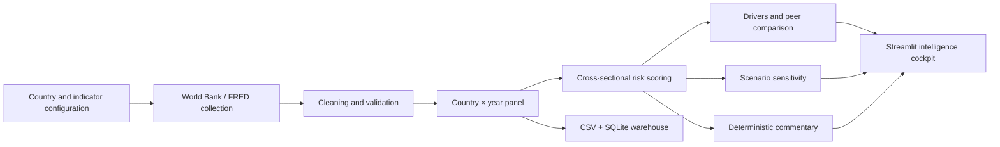

# Country Risk Intelligence Engine

An auditable macroeconomic risk research platform that converts public country
indicators into comparable risk scores, driver decompositions, peer benchmarks,
scenario sensitivities, and analyst-style commentary.

The project is designed as a portfolio-quality example of turning messy public
data into a transparent decision-support product. It is **not** a credit rating,
causal forecasting model, or investment recommendation.

## Product overview

The engine follows a reproducible country-by-year workflow:



## What it delivers

### Analytical engine

- Annual macroeconomic panel across a configurable country universe.
- World Bank indicator collection with a fault-tolerant source boundary.
- FRED Federal Funds Effective Rate integration for the policy-rate proxy.
- Cleaning, numeric coercion, duplicate-key handling, range flags, and coverage reporting.
- Direction-adjusted, weighted, cross-sectional z-score risk model.
- Available-weight renormalization when an indicator is missing.
- Driver-level contribution analysis for every country-year.
- Pooled-panel what-if scenario sensitivity with estimated indicator deltas.
- Rule-based analyst commentary whose claims trace back to computed values.

### Intelligence cockpit

- Animated dark terminal / fintech presentation.
- 0–100 risk score gauge and severity band.
- Historical risk trajectory and year-over-year movement.
- Driver decomposition with positive and mitigating signals.
- Peer-group comparison and median positioning.
- Scenario laboratory for policy-rate shocks.
- Indicator signal board, metadata, coverage, and CSV export.
- Responsive layout with accessible empty states and refresh controls.

The dashboard is a presentation layer, not a second model. The analytical source
of truth remains `score_panel`, `top_drivers`, `run_shock_scenario`, and
`generate_report`.

## Quick start

### 1. Clone the repository and enter it

The commands below must be run **from the repository root**. Running them from
Termux's home directory (`~`) causes `requirements.txt` and the `src` package to
appear “missing”.

```bash
git clone https://github.com/hrxjtsingh1-coder/country-risk-intelligence-engine.git
cd country-risk-intelligence-engine
```

### 2. Install dependencies

Linux, macOS, and Termux:

```bash
python -m venv .venv
source .venv/bin/activate
python -m pip install --upgrade pip
python -m pip install -r requirements.txt
```

On Termux, install the base tools once if needed:

```bash
pkg update
pkg install python git
```

### 3. Launch with a deterministic demo dataset

This is the fastest way to preview the product without waiting for external
data providers:

```bash
python scripts/create_demo_data.py
streamlit run dashboard/app.py
```

The demo data is synthetic and clearly intended for interface demonstration.
It is never mixed with the live data collector.

### 4. Run the live public-data pipeline

Run a small universe first:

```bash
python -m src.pipeline.run_all \
  --countries USA,IND,DEU \
  --start 2015 \
  --end 2025
```

Then launch the dashboard:

```bash
streamlit run dashboard/app.py
```

For the full configured universe, omit `--countries`. The pipeline writes:

```text
data/processed/panel_wide.csv
data/processed/country_risk.db
data/processed/commentary/<ISO3>_<YEAR>.md
```

Generated outputs are intentionally ignored by Git. Re-running the pipeline
clears and reloads derived database rows so repeated runs remain reproducible.

## Model methodology

For each indicator and year, the engine computes a cross-sectional z-score:

```text
z(i,t) = (value(i,t) - mean(value(*,t))) / std(value(*,t))
```

The score then:

1. Applies the configured risk direction, so higher values consistently mean
   more or less risk depending on the indicator.
2. Multiplies each signal by its configured weight.
3. Renormalizes over indicators actually observed for the country-year.
4. Maps the normalized signal onto a bounded 0–100 scale centered at 50.
5. Assigns a transparent band: Low, Moderate, Elevated, High, or Severe.

Weights, directionality, source metadata, and validation bounds live in
`config/indicators.yaml`; the country universe and peer groups live in
`config/countries.yaml`.

Scenario analysis estimates pooled-panel relationships between a selected shock
driver and configured target indicators using simple OLS sensitivity. It is a
stress-test instrument, not a causal estimate.

## Data sources

- [World Bank Indicators API](https://data.worldbank.org/)
- [FRED](https://fred.stlouisfed.org/) Federal Funds Effective Rate (`DFF`)

Collectors are designed to fail gracefully at the individual-series level:
unavailable observations remain missing and are reflected in coverage rather
than being fabricated.

## Repository structure

```text
country-risk-intelligence-engine/
├── .streamlit/config.toml            # Dark dashboard theme
├── config/
│   ├── countries.yaml                # Country universe and peer groups
│   └── indicators.yaml               # Weights, directions, bounds, sources
├── dashboard/app.py                  # Streamlit intelligence cockpit
├── scripts/
│   └── create_demo_data.py           # Offline deterministic showcase data
├── src/
│   ├── cleaning/clean.py             # Validation, cleaning, panel shaping
│   ├── commentary/generate_commentary.py
│   ├── db/                           # SQLite schema and loading utilities
│   ├── indicators/build_panel.py     # World Bank and FRED collectors
│   ├── pipeline/run_all.py           # End-to-end live pipeline
│   ├── scenario/scenario_engine.py   # What-if sensitivity analysis
│   └── scoring/risk_score.py         # Scores and driver decomposition
├── requirements.txt
└── README.md
```

## Quality checks

The source is designed to be easy to validate locally. Compile the application
and generate the offline demo panel with:

```bash
python -m compileall -q src dashboard scripts
python scripts/create_demo_data.py --countries USA,IND,DEU
```

## Limitations and responsible use

- The model is intentionally deterministic and interpretable; it does not claim
  causal identification.
- Country scores are relative to the countries and years available in the panel.
- Missing data can reduce completeness and change the effective score weights.
- Annual indicators are not suitable for short-term market timing.
- Scenario outputs express model sensitivity, not predicted outcomes.
- Validate source revisions, definitions, and publication lags before using the
  output in a real research or risk process.

## Roadmap

- Add persistent data vintage metadata and source snapshots.
- Add configurable regional and income-group benchmarks.
- Add automated data-quality reports for each pipeline run.
- Add a production database adapter and scheduled refresh job.
