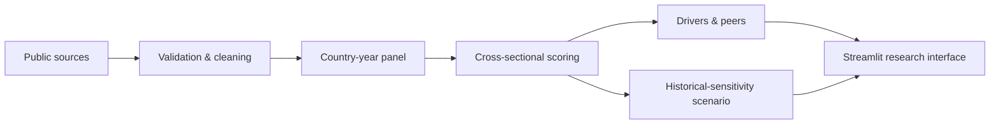

# Country Risk Intelligence Engine

A transparent, reproducible country-risk research prototype that turns public macroeconomic data into **relative-risk positioning**, driver decomposition, peer context, and exploratory stress tests.

> **Responsible use:** This is a university portfolio and decision-support prototype. It is not a credit rating, investment recommendation, sovereign-default probability, forecasting system, or professional financial advice.

## Why this exists

Country-risk work requires more than a dashboard: analysts need traceable sources, clear transformations, reproducible data vintages, explicit limitations, and an explanation for each score. This project demonstrates that workflow without overstating what public annual data or a simple model can establish.

## What it does



- Builds a country-year panel from World Bank Indicators API data, with a US-only FRED enrichment.
- Flags missing, duplicate, and out-of-range observations before pivoting to the scoring panel.
- Produces a deterministic 0–100 **relative** score, contributions, bands, peer comparisons, and rule-based commentary.
- **Deterioration watch**: ranks every tracked country by year-over-year score change and flags anyone who stepped into a worse risk band — a cross-country early-warning view, not just a single-country readout.
- **Model validation (backtest)**: checks the scoring engine's own historical output against known real macro-stress episodes (Turkiye 2018, Brazil 2015-16, South Africa's fiscal deterioration, the UK's 2022 gilt shock) and reports honestly whether the score actually rose — including when it didn't.
- Records a JSON data vintage for live pipeline runs and exposes source series, units, transformations, weights, coverage, and source links in the UI.
- Keeps synthetic demo data explicitly separate from live public data.

## Data modes and data sources

| Mode | UI label | Meaning |
|---|---|---|
| Demo | `DEMO DATA — SYNTHETIC DATASET` | Bundled deterministic fixture for UI/testing. **Not suitable for economic or investment decisions.** |
| Live | `LIVE PUBLIC DATA` | Fetched automatically at runtime from the World Bank Indicators API (`src/runtime/live_data.py`) — no local pipeline run required. Cached 6 hours; **Refresh Live Data** forces a new fetch. |
| Unavailable | `LIVE DATA UNAVAILABLE` | The runtime fetch failed or returned unusable data. The application offers an explicit **Open Demo Dataset** action; it does not silently substitute synthetic data. |

Implemented sources:

- [World Bank Indicators API](https://api.worldbank.org/v2/) for the configured annual macro indicators.
- [FRED DFF](https://fred.stlouisfed.org/series/DFF) as a **US-only enrichment**. `POLICY_RATE_YOY_CHANGE_BPS` is the change in the annual-average Effective Federal Funds Rate, in basis points. It is excluded from the composite score and must not be interpreted as a globally comparable policy-rate series.

BIS and ECB collectors are **not implemented** and are not advertised as supported sources.

## Methodology and model card

### Risk score

For each indicator/year, the scoring engine calculates a country cross-sectional z-score:

`z(i,t) = (value(i,t) − mean(value(*,t))) / std(value(*,t))`

Configured directionality makes positive contributions consistently correspond to more relative risk. Positive-weight indicators must sum to 1.0; missing indicators are excluded and observed weights are renormalized. The weighted signal is mapped around 50 and clipped to 0–100. Therefore:

- The score measures **relative positioning in the available country-year panel**, not absolute country risk.
- A score of 70 does **not** mean 70% probability of loss or default.
- Scores can move as other countries or coverage change, even where a country’s own raw value changes little.

`config/indicators.yaml` is the model input dictionary: code, label, category, source/series/link, frequency, unit, transformation, bounds, direction, and weight. The dashboard’s Model Card and Indicator Dictionary expose this metadata.

### Scenario analysis

`run_shock_scenario()` is a stress-test approximation using pooled-panel bivariate OLS: `target = alpha + beta × shock driver`. It reports baseline/shocked values, target deltas, R², sample size, estimation window, specification, an information-quality label, and an out-of-sample-shock flag. It is a **historical association**, not causal identification, a forecast, or an expected outcome. It has no controls, lags, or country-specific transmission mechanism.

### Data quality and reproducibility

Each live run writes `data/processed/data_metadata.json`, including run ID, retrieval timestamps, requested period, latest observation, country and indicator counts, source URLs, observation totals, and methodology/config version. The dashboard reports panel coverage, missing observations, duplicate country-years, configured range errors, and data state.

## Project structure

```text
config/                 country universe and indicator model dictionary
data/demo/              tracked synthetic fixture only
src/cleaning/           cleaning, validation, coverage and wide-panel shaping
src/indicators/         World Bank and US-only FRED collection
src/scoring/            deterministic relative score and driver contributions
src/scenario/           pooled-panel historical-sensitivity stress test
src/commentary/         deterministic, rule-based analytical commentary
src/pipeline/           reproducible end-to-end live run
dashboard/app.py        Streamlit research interface
tests/                  deterministic analytical tests
```

## Installation and running

```bash
python -m venv .venv
source .venv/bin/activate
python -m pip install -r requirements.txt
```

### Live mode (automatic)

```bash
streamlit run dashboard/app.py
```

No setup step required — on load, the app itself calls the World Bank
Indicators API at runtime (`src/runtime/live_data.py`) for every country in
`config/countries.yaml` and every indicator in `config/indicators.yaml`,
batched one HTTP request per indicator (not per country), with retries and
a 6-hour cache so switching country/year in the sidebar never triggers a
new fetch. It automatically selects the newest year with enough
cross-country coverage to score reliably (never just "the current calendar
year") and shows a **LIVE PUBLIC DATA** card with source, retrieval time,
latest observation year, and coverage — so where a number came from is
always visible in the app itself, not just in the source code.

If the live fetch fails or returns unusable data, the app shows
**LIVE DATA UNAVAILABLE** with exactly one explicit action — **Open Demo
Dataset** — and never silently substitutes synthetic data for real data.
From demo mode, **Return to Live Data** clears the cache and retries.
**↻ Refresh Live Data** (shown once live data is loaded) forces a fresh
fetch on demand.

### Optional: offline pipeline

```bash
python -m src.pipeline.run_all --countries USA,IND,DEU --start 2015 --end 2025
```

Still useful for reproducible local runs or notebooks, but the deployed
app no longer depends on its output existing on disk (Streamlit Community
Cloud instances don't reliably persist local files between deploys) — live
mode builds the panel in memory for the session instead.

The collector retries transient HTTP failures with exponential backoff and
logs per-series failures. A source failure produces missing coverage
rather than invented observations. Streamlit Cloud should use
`streamlit_app.py` as its main file; it re-executes the dashboard safely
on reruns.

## Testing and deployment

```bash
pytest
python -m compileall -q src dashboard scripts
```

GitHub Actions runs `pytest` on pushes and pull requests — live-data tests
mock all HTTP calls (`tests/test_live_data.py`), so CI never depends on
the real World Bank API being reachable. For deployment, configure
Streamlit Community Cloud with this repository, Python dependencies from
`requirements.txt`, and main file `streamlit_app.py`.

## Limitations and roadmap

The model depends on public-source definitions, revisions, publication lags, and the selected country universe. Missing data alters effective weights and may conceal an unmeasured vulnerability. The backtest checks 4 known episodes against an annual, backward-looking, cross-sectional model — it will structurally lag fast-moving shocks that unfold within a single year, and a small episode count means "flagged" is encouraging, not proof. Future work includes source snapshots, documented multi-country policy-rate series, a larger backtest set, and scheduled provenance-aware refreshes.

## Recruiter view

This project demonstrates data engineering (batched API collection, validation, retries/backoff, reproducible provenance), quantitative risk analysis (cross-sectional normalization, weighted contributions, sensitivity diagnostics, historical backtesting against real crises), governance (source traceability, model limitations, responsible-language controls), and product design (institutional dark UI, mobile-aware layouts, explicit data states, onboarding, and exports). The intended evidence is not a claim of predictive authority; it is evidence of disciplined analytical engineering — including a model card that says plainly where the approach would and wouldn't hold up.
